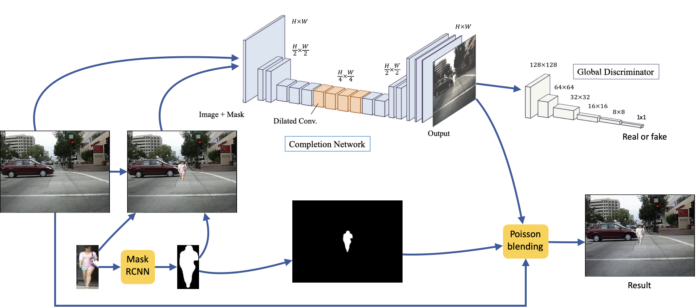

# pedestrian_generator

This repo was clone from [GLCIC-PyTorch](https://github.com/otenim/GLCIC-PyTorch)

# What we do?

## Prepare training dataset

 In our last version, we first convert [Caltech Pedestrian Detection Benchmark](http://www.vision.caltech.edu/Image_Datasets/CaltechPedestrians/) dataset to image files by [caltech_pedestrian_extractor](https://github.com/dbcollection/caltech_pedestrian_extractor)(.seq to .jpg).

 And we separate the caltech in two dataset, one have pedestrian on the image and the others is not.

 > see [caltech_for_detectron.ipynb](create_data/caltech_for_detectron.ipynb)

And we also prepare the pedestrian data from [Market-1501 Dataset](http://www.liangzheng.com.cn/Project/project_reid.html) dataset with mask which from datectron

> see [market_to_mask.ipynb](create_data/market_to_mask.ipynb)

Finaly, we have dataseta from above to generate our training dataset. We ramdly selecte three posisition where people will be pasted and record the coordinate, the scale and people image index in .json format.
Each image have 2 or 3 people (half chance)

> see [gandatamask5_multi.ipynb](create_data/gandatamask5_multi.ipynb)

In the training dataset

caltech_origin_mask8_42000.zip
├── street
├── people
├── mask
├── json
└── street_json

## Training 

In training step, we paste people in the center of the image.

and we have three phase.

> phase 1 > training the generator 

> phase 2 > training the discriminator

> phase 3 > training both generator and discriminator

> see [gandatamask5_multi.ipynb](gandatamask5_multi.ipynb)

## Generate our new dataset to benchmark

> see [generator_v2.ipynb](generator_v2.ipynb)

## Benchmark

