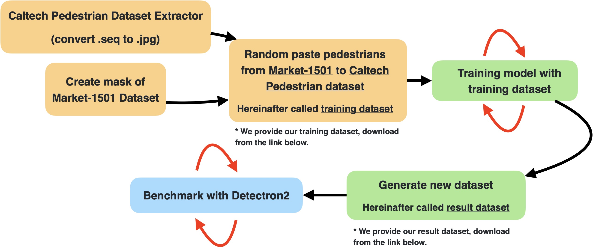

# pedestrian_generator

This repo was clone from [GLCIC-PyTorch](https://github.com/otenim/GLCIC-PyTorch)

# What we do?

## Prepare training dataset

In our last version, we first convert [Caltech Pedestrian Detection Benchmark](http://www.vision.caltech.edu/Image_Datasets/CaltechPedestrians/) dataset to image files by [caltech_pedestrian_extractor](https://github.com/dbcollection/caltech_pedestrian_extractor)(.seq to .jpg).

And we separate the caltech in two dataset.(The imgae which have pedestrian on i will disturb the result)
1. already have pedestrian on the image  > this can be used as baseline data as comparison.
2. no pedestrian on the image  >  this can be use as training dataset.

⬇️[have pedestrian](https://drive.google.com/file/d/1FOgnF9kFjp5d9xpFZnnprfUI1pYs80MY/view?usp=sharing)
⬇️[no pedestrian](https://drive.google.com/file/d/1FOgnF9kFjp5d9xpFZnnprfUI1pYs80MY/view?usp=sharing)

> see [caltech_for_detectron.ipynb](00_download_and_preprocess/caltech_for_detectron.ipynb)

And we also prepare the pedestrian data from [Market-1501 Dataset](http://www.liangzheng.com.cn/Project/project_reid.html) dataset with mask which from datectron

> see [market_to_mask.ipynb](00_download_and_preprocess/market_to_mask.ipynb)

Finally, we have dataset from above to generate our training dataset. We randomly selecte three posisition where people will be pasted and record the coordinate, the scale and the index of people image in .json format.
Each image have 2 or 3 people (half chance)

> see [gandatamask5_multi.ipynb](01_gene_train_dataset/gandatamask5_multi.ipynb)

⬇️[training dataset](https://drive.google.com/drive/folders/1tsWYMVWiWAKW0S4CFPupRY1QRCfiAWqN?usp=sharing)

In the training dataset

caltech_origin_mask8_42000.zip\
├── street\
├── people\
├── mask\
├── json\
└── street_json

## Training 

In training step, we paste people in the center of the image.

and we have three phase.

> phase 1 > training the generator \
> phase 2 > training the discriminator\
> phase 3 > training both generator and discriminator

> see [gandatamask5_multi.ipynb](gandatamask5_multi.ipynb)

## Generate our new dataset to benchmark

> see [generator_v2.ipynb](generator_v2.ipynb)

## Benchmark

`Baseline`: We use 42000 images which have pedestrian on the image in caltech dataset and training in 126000 iterations.

`Our new dataset`: We use 40000 images we generated and training in 30000 iterations. After that, we training 42000 images from caltech dataset and training in 80000 iterations.

[Detectron2 Benchmark usage](Detectron2)

# Contributors

- [x] [Tony Guo](https://github.com/tony92151) - @Tony Guo

> `Prepare training dataset`\
> `Training`\
> `Discuss`\
> `Presentation`

- [x] [AntonyKo](https://github.com/a8252525) - @AntonyKo

> `Training`\
> `Benchmark`\
> `Discuss`\
> `Presentation`

- [x] [Jeff](https://github.com/Jeff860530) - @Jeff

> `Prepare training dataset`\
> `Discuss`\
> `Presentation`

